# Personal

A Flutter app that pulls together personal data from several sources—health, spending, location, gaming, and calendar—and runs a unified **monthly analysis** workflow. You pick which sources to include, configure how the AI should reason about your life, and get structured insights plus weekly checklists for the month ahead.

**Version:** 2.0.1  
**Platform:** Android (primary)

## What it does

Personal acts as a private **data hub**. Each feature module loads and summarizes one domain. From the home screen you can open any module or run **Run analysis**, which builds a prompt from your selected sources and either calls an external AI API (OpenAI or Gemini) or generates insights locally.

Analysis is scoped to the **current calendar month through today**. Parsed action items become **weekly checklists** for the following month, with optional local notifications when the month ends.

## Screenshots

Walk through the app in the same order you would use it: open the hub, connect data, run analysis, review insights, then plan the month ahead.

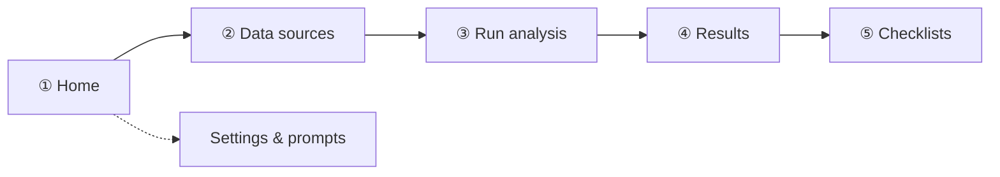

---

### ① Home — open the data hub

Start on the home grid. Each tile opens a data module; **Run analysis** sits at the bottom when you are ready.

<table cellpadding="28" cellspacing="20" border="0">
  <tr>
    <td align="center" width="50%" valign="top" style="padding: 16px 24px;">
      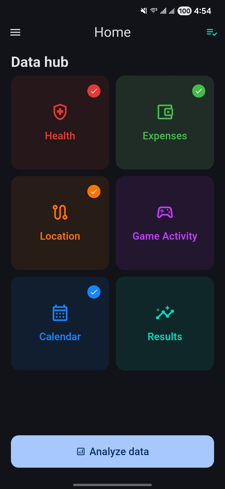<br><br>
      <sub><b>Home</b> — data hub & run analysis</sub>
    </td>
    <td align="center" width="50%" valign="top" style="padding: 16px 24px;">
      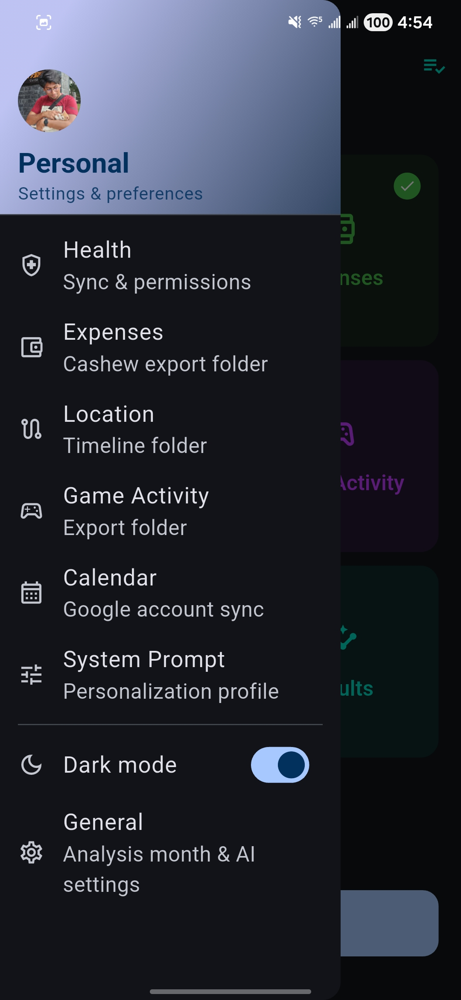<br><br>
      <sub><b>Drawer</b> — settings & shortcuts</sub>
    </td>
  </tr>
</table>

---

### ② Data sources — connect each module

Open a tile to load that month’s data. Health Connect, Cashew exports, location files, game CSV, and Google Calendar each feed the same analysis pipeline.

<table cellpadding="28" cellspacing="20" border="0">
  <tr>
    <td align="center" width="50%" valign="top" style="padding: 16px 24px;">
      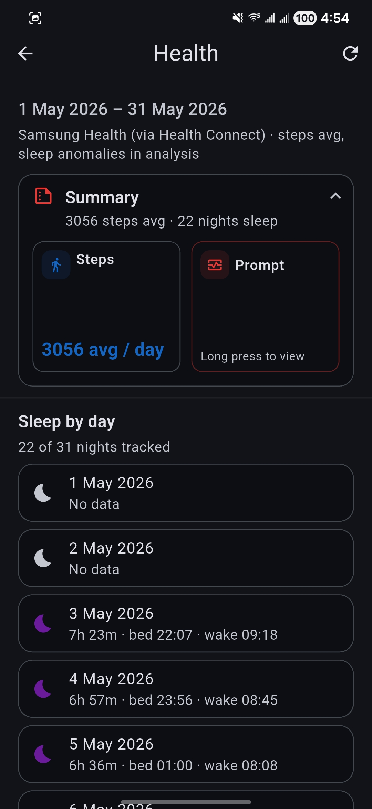<br><br>
      <sub><b>Health</b> — steps & sleep</sub>
    </td>
    <td align="center" width="50%" valign="top" style="padding: 16px 24px;">
      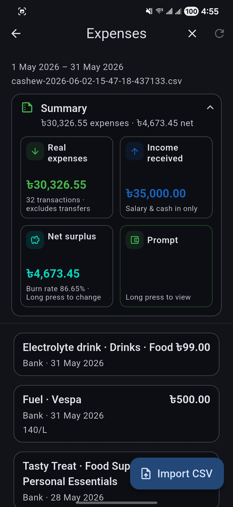<br><br>
      <sub><b>Expenses</b> — Cashew CSV</sub>
    </td>
  </tr>
  <tr>
    <td align="center" colspan="2" height="12"></td>
  </tr>
  <tr>
    <td align="center" width="50%" valign="top" style="padding: 16px 24px;">
      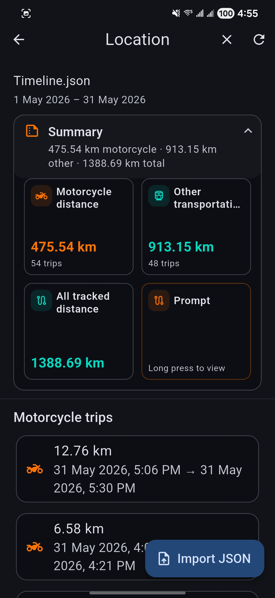<br><br>
      <sub><b>Location</b> — timeline export</sub>
    </td>
    <td align="center" width="50%" valign="top" style="padding: 16px 24px;">
      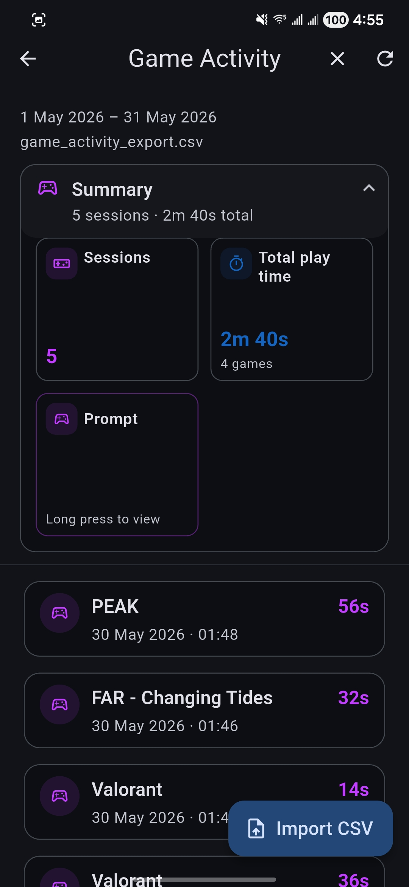<br><br>
      <sub><b>Game activity</b> — session log</sub>
    </td>
  </tr>
  <tr>
    <td align="center" colspan="2" height="12"></td>
  </tr>
  <tr>
    <td align="center" colspan="2" valign="top" style="padding: 16px 24px;">
      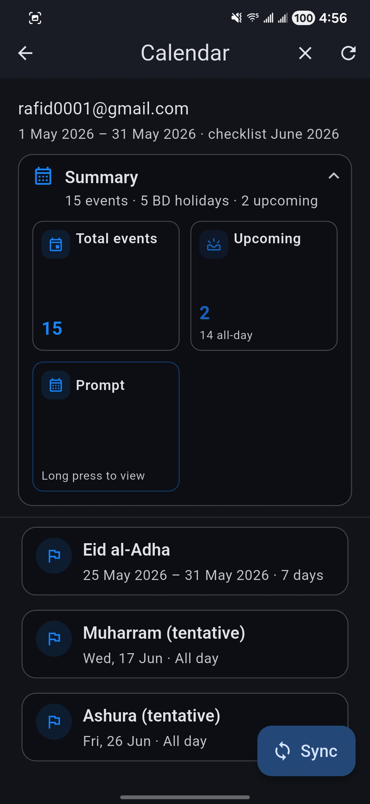<br><br>
      <sub><b>Calendar</b> — Google Calendar sync</sub>
    </td>
  </tr>
</table>

---

### ③ Run analysis — pick sources for this month

Choose which modules to include, then generate insights for the current month (local or via OpenAI / Gemini).

<table cellpadding="28" cellspacing="20" border="0">
  <tr>
    <td align="center" colspan="2" valign="top" style="padding: 20px 24px;">
      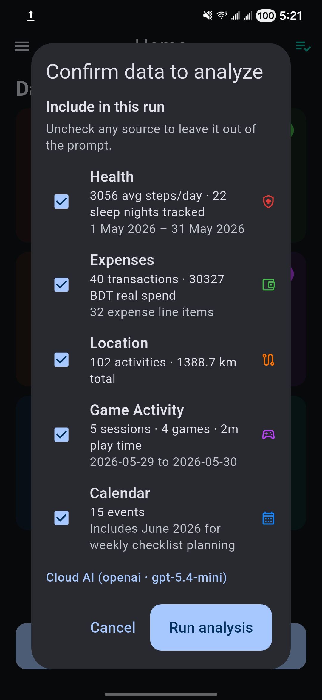<br><br>
      <sub><b>Run analysis</b> — select data sources</sub>
    </td>
  </tr>
</table>

---

### ④ Results — read monthly insights

Saved runs appear in **Results**. Open one to read the full report, prompt, and parsed action items.

<table cellpadding="28" cellspacing="20" border="0">
  <tr>
    <td align="center" width="50%" valign="top" style="padding: 16px 24px;">
      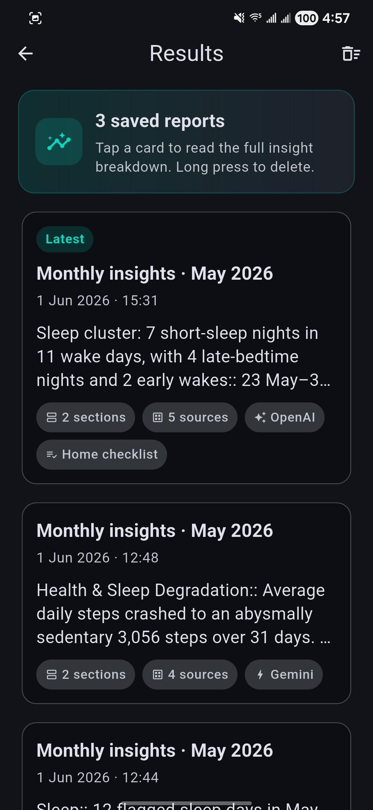<br><br>
      <sub><b>Results</b> — saved runs</sub>
    </td>
    <td align="center" width="50%" valign="top" style="padding: 16px 24px;">
      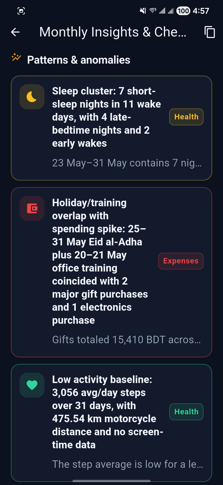<br><br>
      <sub><b>Results</b> — insight detail</sub>
    </td>
  </tr>
</table>

---

### ⑤ Checklists — plan the month ahead

Action items from an analysis become weekly checklists for the following month.

<table cellpadding="28" cellspacing="20" border="0">
  <tr>
    <td align="center" colspan="2" valign="top" style="padding: 20px 24px;">
      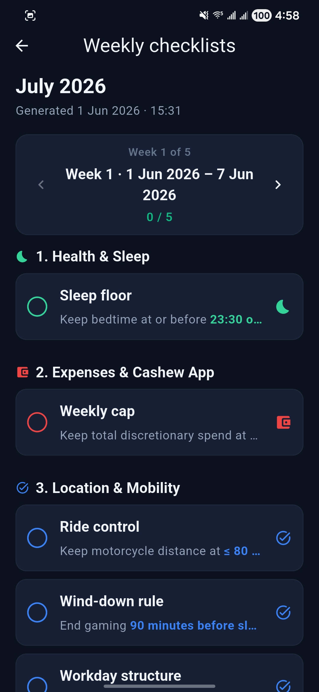<br><br>
      <sub><b>Checklists</b> — weekly segments</sub>
    </td>
  </tr>
</table>

---

### Settings — tune prompts & AI

Configure assistant identity, focus areas, and API settings from the drawer (**Prompts**, **General settings**).

<table cellpadding="28" cellspacing="20" border="0">
  <tr>
    <td align="center" colspan="2" valign="top" style="padding: 20px 24px;">
      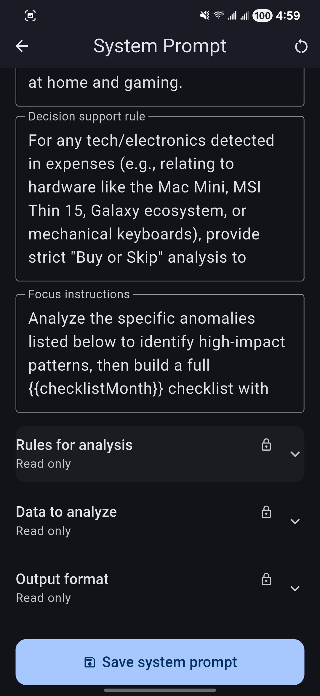<br><br>
      <sub><b>Prompts</b> — AI & analysis tone</sub>
    </td>
  </tr>
</table>

## Features

| Module | Data source | Role in analysis |
|--------|-------------|------------------|
| **Health** | Health Connect (steps, sleep) | Monthly averages, daily breakdowns, anomaly filtering |
| **Expenses** | Cashew CSV export folder | Totals, categories, real vs. excluded transactions |
| **Location** | User-selected timeline export files | Activity patterns for the analysis month |
| **Game activity** | CSV export (e.g. gaming tracker) | Session summaries |
| **Calendar** | Google Calendar (OAuth) | Events merged into the analysis snapshot |
| **Results** | Generated locally or via API | Stored runs, rich-text reports, actionable checklists |

Supporting screens (drawer): **Prompts** (system instructions and focus), **General settings** (analysis month, AI provider, notifications), and per-feature **settings** (folders, permissions, Google sign-in).

## Architecture

```
lib/
  app/              # App shell and route table
  core/             # Analysis period, caching, notifications
  features/         # health, expenses, location, game_activity, calendar, results, prompts, home, settings
  shell/            # Drawer navigation
  theme/            # Colors, light/dark theme
  widgets/          # Shared UI (tiles, metrics, pinned summaries)
```

- **State:** [flutter_riverpod](https://pub.dev/packages/flutter_riverpod)
- **Health:** [health](https://pub.dev/packages/health) + Health Connect on device
- **Files:** [file_picker](https://pub.dev/packages/file_picker), [dir_picker](https://pub.dev/packages/dir_picker), [uri_content](https://pub.dev/packages/uri_content)
- **Calendar:** [google_sign_in](https://pub.dev/packages/google_sign_in) + [googleapis](https://pub.dev/packages/googleapis)
- **Notifications:** [flutter_local_notifications](https://pub.dev/packages/flutter_local_notifications) (month-end analysis reminder)

## Getting started

### Prerequisites

- Flutter SDK (Dart ^3.11)
- Android device or emulator
- For health: **Health Connect** installed; grant Steps and Sleep (e.g. via Samsung Health → Health Connect)
- For expenses: **Cashew** export folder on device storage
- For calendar: Google account with Calendar API access
- Optional: API keys for OpenAI or Gemini in general settings

### Run

```bash
flutter pub get
flutter run
```

### Tests

```bash
flutter test
```

## Privacy & data

All personal data stays on the device unless you enable **API calls** for analysis. Cached summaries are stored locally via `shared_preferences` and the data cache service. Google sign-in is used only for calendar sync when you connect an account.

## Screenshot checklist

| File | Screen |
|------|--------|
| `docs/screenshots/01-home.png` | Home / Data hub |
| `docs/screenshots/02-health.png` | Health summary |
| `docs/screenshots/03-expenses.png` | Expenses |
| `docs/screenshots/04-location.png` | Location |
| `docs/screenshots/05-game-activity.png` | Game activity |
| `docs/screenshots/06-calendar.png` | Calendar |
| `docs/screenshots/07-analysis-confirm.png` | Analysis source picker |
| `docs/screenshots/08-results.png` | Results list |
| `docs/screenshots/09-checklists.png` | Weekly checklists |
| `docs/screenshots/10-prompts.png` | Prompts configuration |
| `docs/screenshots/11-drawer.png` | Navigation drawer |
| `docs/screenshots/12-results-details.png` | Results — insight detail |

## License

Private project — not published to pub.dev (`publish_to: 'none'`).
