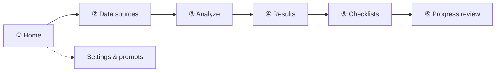
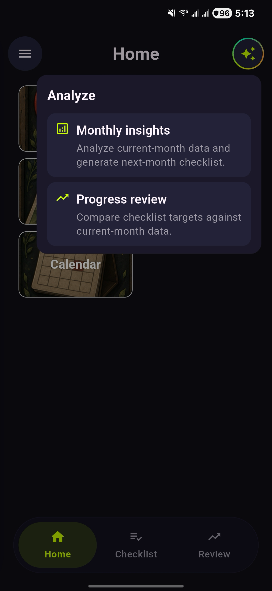
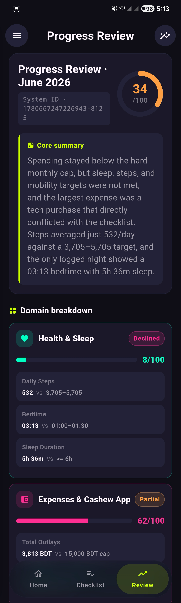
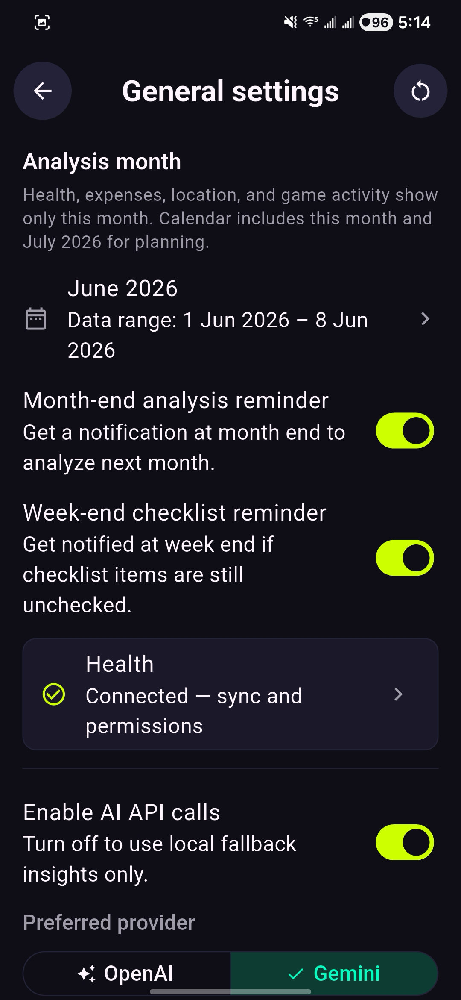

# Personal

A Flutter app that pulls together personal data from several sources—health, spending, location, gaming, and calendar—and runs unified **analysis** workflows. You pick which sources to include, configure how the AI should reason about your life, and get structured insights plus weekly checklists for the month ahead.

**Version:** 2.1.4  
**Platform:** Android (primary)

## What it does

Personal acts as a private **data hub**. Each feature module loads and summarizes one domain. The main shell has three tabs—**Home**, **Checklist**, and **Review**—plus a slide-out drawer for settings.

From **Home**, open any data module or tap the **Analyze** button to choose between:

- **Monthly insights** — analyze current-month data and generate next-month checklists
- **Progress review** — compare checklist targets against current-month data and score each domain

Analysis is scoped to the **current calendar month through today**. Parsed action items become **weekly checklists** for the following month, with optional local notifications when the month ends or a week ends with unchecked items.

## Screenshots

Walk through the app in the same order you would use it: open the hub, connect data, run analysis, review insights, track checklists, and score progress.



---

### ① Home — open the data hub

Start on the home grid. Each tile opens a data module. The bottom nav switches between **Home**, **Checklist**, and **Review**. Tap **Analyze** (sparkle button) when you are ready.

<table cellpadding="28" cellspacing="20" border="0">
  <tr>
    <td align="center" width="50%" valign="top" style="padding: 16px 24px;">
      <br><br>
      <sub><b>Home</b> — data hub & bottom nav</sub>
    </td>
    <td align="center" width="50%" valign="top" style="padding: 16px 24px;">
      <br><br>
      <sub><b>Drawer</b> — settings & shortcuts</sub>
    </td>
  </tr>
</table>

---

### ② Data sources — connect each module

Open a tile to load that month’s data. Health Connect, Cashew exports, location files, game CSV, and Google Calendar each feed the same analysis pipeline.

<table cellpadding="28" cellspacing="20" border="0">
  <tr>
    <td align="center" width="50%" valign="top" style="padding: 16px 24px;">
      <br><br>
      <sub><b>Health</b> — steps & sleep</sub>
    </td>
    <td align="center" width="50%" valign="top" style="padding: 16px 24px;">
      <br><br>
      <sub><b>Expenses</b> — Cashew CSV</sub>
    </td>
  </tr>
  <tr>
    <td align="center" colspan="2" height="12"></td>
  </tr>
  <tr>
    <td align="center" width="50%" valign="top" style="padding: 16px 24px;">
      <br><br>
      <sub><b>Location</b> — timeline export</sub>
    </td>
    <td align="center" width="50%" valign="top" style="padding: 16px 24px;">
      <br><br>
      <sub><b>Game activity</b> — session log</sub>
    </td>
  </tr>
  <tr>
    <td align="center" colspan="2" height="12"></td>
  </tr>
  <tr>
    <td align="center" colspan="2" valign="top" style="padding: 16px 24px;">
      <br><br>
      <sub><b>Calendar</b> — Google Calendar sync</sub>
    </td>
  </tr>
</table>

---

### ③ Analyze — pick a run type and sources

Tap **Analyze** on Home to choose **Monthly insights** or **Progress review**, then confirm which data sources to include for the current month.

<table cellpadding="28" cellspacing="20" border="0">
  <tr>
    <td align="center" width="50%" valign="top" style="padding: 16px 24px;">
      <br><br>
      <sub><b>Analyze</b> — monthly insights or progress review</sub>
    </td>
    <td align="center" width="50%" valign="top" style="padding: 16px 24px;">
      <br><br>
      <sub><b>Confirm</b> — select data sources</sub>
    </td>
  </tr>
</table>

---

### ④ Results — read monthly insights

Saved monthly-insight runs appear in **Results** (opened from the Review tab). Tap a card to read the full report and parsed action items.

<table cellpadding="28" cellspacing="20" border="0">
  <tr>
    <td align="center" width="50%" valign="top" style="padding: 16px 24px;">
      <br><br>
      <sub><b>Results</b> — saved runs</sub>
    </td>
    <td align="center" width="50%" valign="top" style="padding: 16px 24px;">
      <br><br>
      <sub><b>Results</b> — insight detail</sub>
    </td>
  </tr>
</table>

---

### ⑤ Checklists — plan the month ahead

Action items from a monthly-insights run become weekly checklists for the following month. Switch weeks from the horizontal picker.

<table cellpadding="28" cellspacing="20" border="0">
  <tr>
    <td align="center" colspan="2" valign="top" style="padding: 20px 24px;">
      <br><br>
      <sub><b>Checklist</b> — weekly segments & themes</sub>
    </td>
  </tr>
</table>

---

### ⑥ Progress review — score checklist targets

The **Review** tab shows how current-month data compares to checklist targets, with an overall score and per-domain breakdown.

<table cellpadding="28" cellspacing="20" border="0">
  <tr>
    <td align="center" colspan="2" valign="top" style="padding: 20px 24px;">
      <br><br>
      <sub><b>Review</b> — targets vs actuals</sub>
    </td>
  </tr>
</table>

---

### Settings — tune prompts & AI

Configure assistant identity, analysis month, reminders, and API settings from the drawer (**System Prompt**, **General**).

<table cellpadding="28" cellspacing="20" border="0">
  <tr>
    <td align="center" width="50%" valign="top" style="padding: 16px 24px;">
      <br><br>
      <sub><b>System Prompt</b> — AI & analysis tone</sub>
    </td>
    <td align="center" width="50%" valign="top" style="padding: 16px 24px;">
      <br><br>
      <sub><b>General</b> — month, reminders & AI provider</sub>
    </td>
  </tr>
</table>

## Features

| Module | Data source | Role in analysis |
|--------|-------------|------------------|
| **Health** | Health Connect (steps, sleep) | Monthly averages, daily breakdowns, anomaly filtering |
| **Expenses** | Cashew CSV export folder | Totals, categories, real vs. excluded transactions |
| **Location** | User-selected timeline export files | Activity patterns for the analysis month |
| **Game activity** | CSV export (e.g. gaming tracker) | Session summaries |
| **Calendar** | Google Calendar (OAuth) | Events merged into the analysis snapshot |
| **Results** | Generated locally or via API | Stored monthly-insight runs, rich-text reports, actionable checklists |
| **Progress review** | Checklist targets + current-month data | Domain scores comparing targets to actuals |

**Main shell tabs:** **Home** (data hub), **Checklist** (weekly segments), **Review** (progress scores; opens Results list from the app bar).

Supporting screens (drawer): **System Prompt** (assistant instructions and personal profile), **General** (analysis month, Health Connect, AI provider, notifications), and per-feature **settings** (folders, permissions, Google sign-in).

## Architecture

```
lib/
  app/                  # App widget and route table
  core/                 # Period ranges, caching, notifications, theme
  features/
    analysis/           # Analysis kinds, launcher, report storage
    auth/               # Google account / Firebase auth
    calendar/           # Google Calendar sync
    expenses/           # Cashew CSV parsing
    game_activity/      # Gaming session CSV
    health/             # Health Connect data
    home/               # Home grid, analyze & confirm dialogs
    location/           # Timeline export parsing
    progress_review/    # Checklist-vs-actual scoring dashboard
    prompts/            # System prompt & personal information
    results/            # Insights, checklists, saved runs
    settings/           # General settings & AI provider
  shared/               # Shared widgets and navigation helpers
  shell/                # Main shell, drawer, bottom nav
```

- **State:** [flutter_riverpod](https://pub.dev/packages/flutter_riverpod)
- **Health:** [health](https://pub.dev/packages/health) + Health Connect on device
- **Files:** [file_picker](https://pub.dev/packages/file_picker), [dir_picker](https://pub.dev/packages/dir_picker), [uri_content](https://pub.dev/packages/uri_content)
- **Calendar:** [google_sign_in](https://pub.dev/packages/google_sign_in) + [googleapis](https://pub.dev/packages/googleapis)
- **Notifications:** [flutter_local_notifications](https://pub.dev/packages/flutter_local_notifications) (month-end analysis and week-end checklist reminders)

## Getting started

### Prerequisites

- Flutter SDK (Dart ^3.11)
- Android device or emulator
- Firebase config (not committed): copy `lib/firebase_options.dart.example` to `lib/firebase_options.dart`, or run `flutterfire configure --project=<project-id>` to generate `lib/firebase_options.dart` and `android/app/google-services.json`
- For health: **Health Connect** installed; grant Steps and Sleep (e.g. via Samsung Health → Health Connect)
- For expenses: **Cashew** export folder on device storage
- For calendar: Google account with Calendar API access
- Optional: API keys for OpenAI or Gemini in general settings

### Run

```bash
flutter pub get
flutter run
```

### Tests

```bash
flutter test
```

## Privacy & data

All personal data stays on the device unless you enable **API calls** for analysis. Cached summaries are stored locally via `shared_preferences` and the data cache service. Google sign-in is used only for calendar sync when you connect an account.

## Screenshot checklist

| File | Screen |
|------|--------|
| `docs/screenshots/01-home.png` | Home / Data hub |
| `docs/screenshots/02-health.png` | Health summary |
| `docs/screenshots/03-expenses.png` | Expenses |
| `docs/screenshots/04-location.png` | Location |
| `docs/screenshots/05-game-activity.png` | Game activity |
| `docs/screenshots/06-calendar.png` | Calendar |
| `docs/screenshots/07-analysis-confirm.png` | Analysis source picker |
| `docs/screenshots/08-results.png` | Results list |
| `docs/screenshots/09-checklists.png` | Weekly checklists |
| `docs/screenshots/10-prompts.png` | System Prompt configuration |
| `docs/screenshots/11-drawer.png` | Navigation drawer |
| `docs/screenshots/12-results-details.png` | Results — insight detail |
| `docs/screenshots/13-analyze-options.png` | Analyze — run type picker |
| `docs/screenshots/14-progress-review.png` | Progress review dashboard |
| `docs/screenshots/15-general-settings.png` | General settings |

## License

Private project — not published to pub.dev (`publish_to: 'none'`).
