# Personal

A private Flutter app that pulls together personal data from several sources—health, spending, location, gaming, and calendar—and runs unified **analysis** workflows. You pick which sources to include, configure how the AI should reason about your life, and get structured insights plus weekly checklists for the month ahead, then score your progress against those checklists the following month.

**Version:** 2.2.1  
**Platform:** Android (primary); an `ios/` runner exists but is untracked and experimental

## What it does

Personal acts as a private **data hub**. Each feature module loads and summarizes one domain. The main shell has three tabs—**Home**, **Checklist**, and **Review**—plus a slide-out drawer for settings. A first-run **onboarding** walkthrough guides setup (data folder, personal profile, sources).

From **Home**, open any data module or tap the **Analyze** button to choose between:

- **Monthly insights** — analyze current-month data and generate next-month checklists
- **Progress review** — compare checklist targets against current-month data and score each domain

Analysis is scoped to the **current calendar month through today**. Parsed action items become **weekly checklists** for the following month, with optional local notifications when the month ends or a week ends with unchecked items.

## Screenshots

Walk through the app in the same order you would use it: open the hub, connect data, run analysis, review insights, track checklists, and score progress.

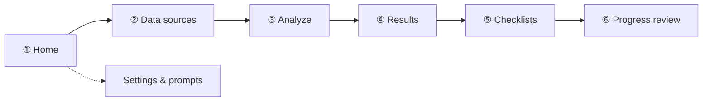
```mermaid
flowchart LR
  A["① Home"] --> B["② Data sources"]
  B --> C["③ Analyze"]
  C --> D["④ Results"]
  D --> E["⑤ Checklists"]
  E --> F["⑥ Progress review"]
  A -.-> G["Settings & prompts"]
```

---

### ① Home — open the data hub

Start on the home grid. Each tile opens a data module. The bottom nav switches between **Home**, **Checklist**, and **Review**. Tap **Analyze** (sparkle button) when you are ready.

<table cellpadding="28" cellspacing="20" border="0">
  <tr>
    <td align="center" width="50%" valign="top" style="padding: 16px 24px;">
      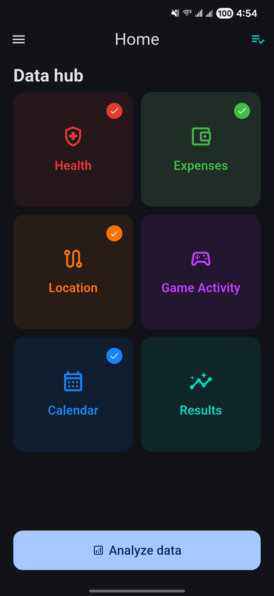<br><br>
      <sub><b>Home</b> — data hub & bottom nav</sub>
    </td>
    <td align="center" width="50%" valign="top" style="padding: 16px 24px;">
      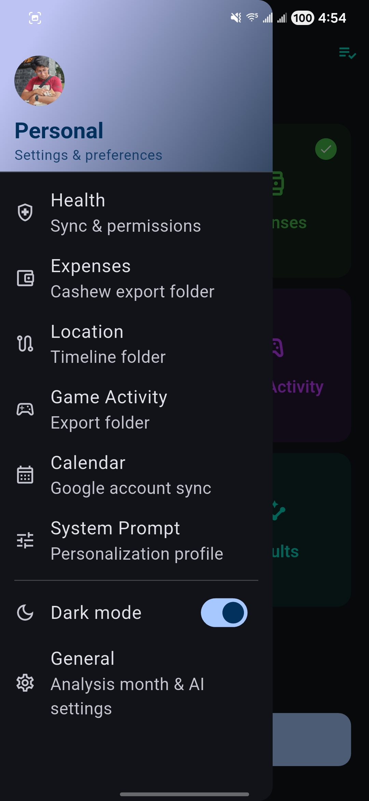<br><br>
      <sub><b>Drawer</b> — settings & shortcuts</sub>
    </td>
  </tr>
</table>

---

### ② Data sources — connect each module

Open a tile to load that month’s data. Health Connect, Cashew exports, location files, game CSV, and Google Calendar each feed the same analysis pipeline.

<table cellpadding="28" cellspacing="20" border="0">
  <tr>
    <td align="center" width="50%" valign="top" style="padding: 16px 24px;">
      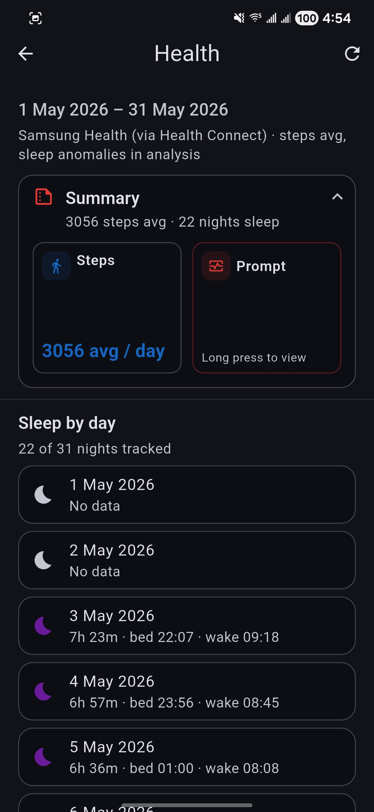<br><br>
      <sub><b>Health</b> — steps & sleep</sub>
    </td>
    <td align="center" width="50%" valign="top" style="padding: 16px 24px;">
      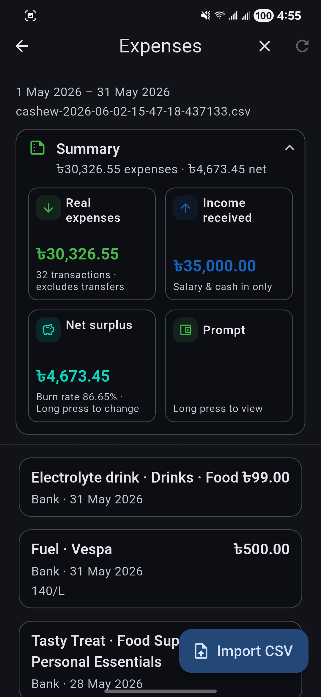<br><br>
      <sub><b>Expenses</b> — Cashew CSV</sub>
    </td>
  </tr>
  <tr>
    <td align="center" colspan="2" height="12"></td>
  </tr>
  <tr>
    <td align="center" width="50%" valign="top" style="padding: 16px 24px;">
      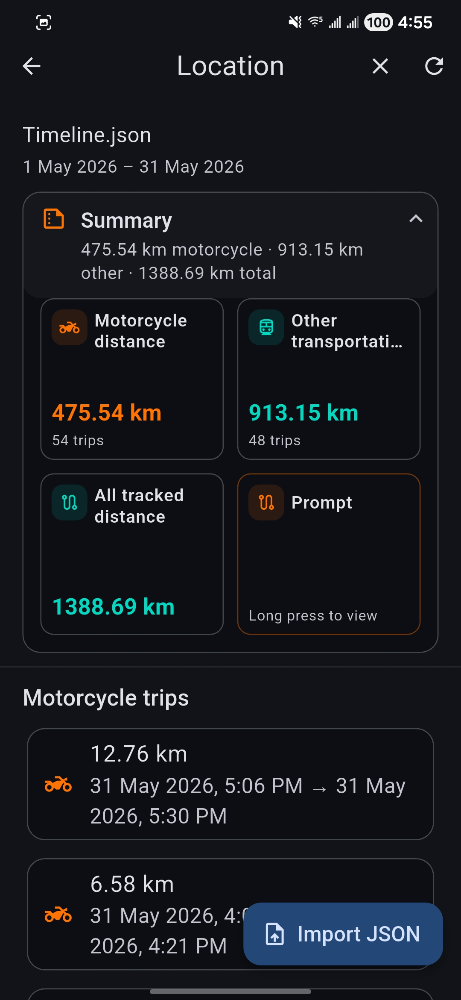<br><br>
      <sub><b>Location</b> — timeline export</sub>
    </td>
    <td align="center" width="50%" valign="top" style="padding: 16px 24px;">
      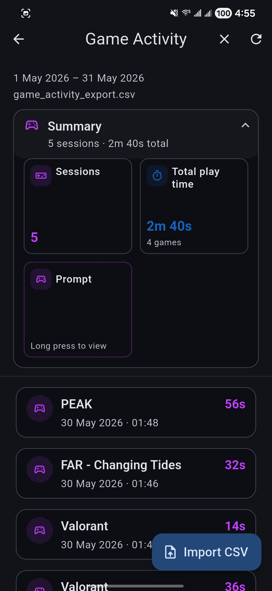<br><br>
      <sub><b>Game activity</b> — session log</sub>
    </td>
  </tr>
  <tr>
    <td align="center" colspan="2" height="12"></td>
  </tr>
  <tr>
    <td align="center" colspan="2" valign="top" style="padding: 16px 24px;">
      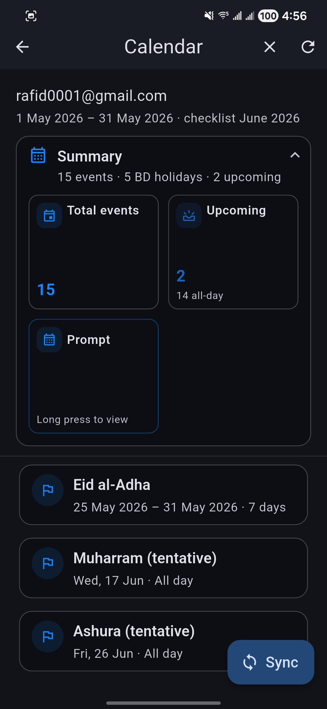<br><br>
      <sub><b>Calendar</b> — Google Calendar sync</sub>
    </td>
  </tr>
</table>

---

### ③ Analyze — pick a run type and sources

Tap **Analyze** on Home to choose **Monthly insights** or **Progress review**, then confirm which data sources to include for the current month.

<table cellpadding="28" cellspacing="20" border="0">
  <tr>
    <td align="center" width="50%" valign="top" style="padding: 16px 24px;">
      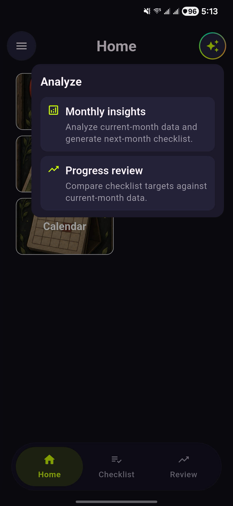<br><br>
      <sub><b>Analyze</b> — monthly insights or progress review</sub>
    </td>
    <td align="center" width="50%" valign="top" style="padding: 16px 24px;">
      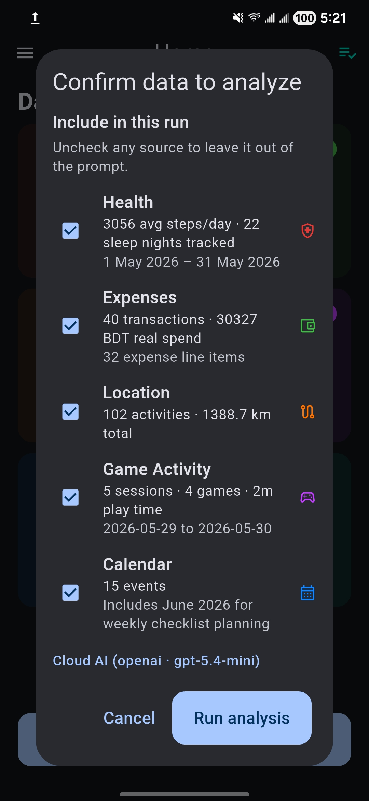<br><br>
      <sub><b>Confirm</b> — select data sources</sub>
    </td>
  </tr>
</table>

---

### ④ Results — read monthly insights

Saved monthly-insight runs appear in **Results** (opened from the Review tab). Tap a card to read the full report and parsed action items.

<table cellpadding="28" cellspacing="20" border="0">
  <tr>
    <td align="center" width="50%" valign="top" style="padding: 16px 24px;">
      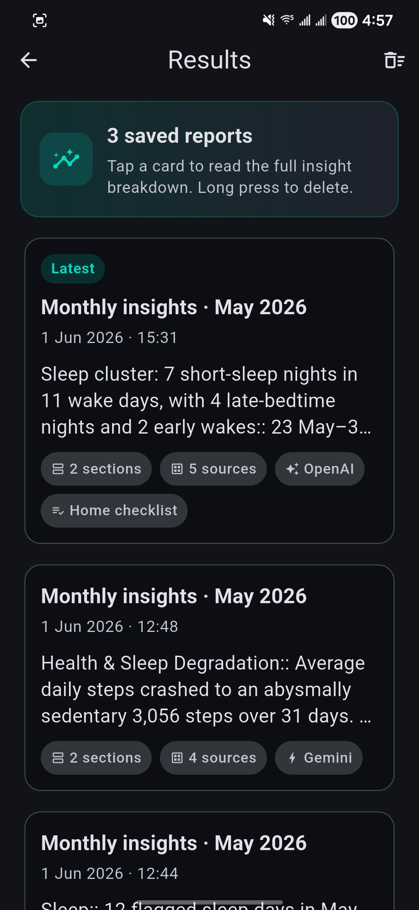<br><br>
      <sub><b>Results</b> — saved runs</sub>
    </td>
    <td align="center" width="50%" valign="top" style="padding: 16px 24px;">
      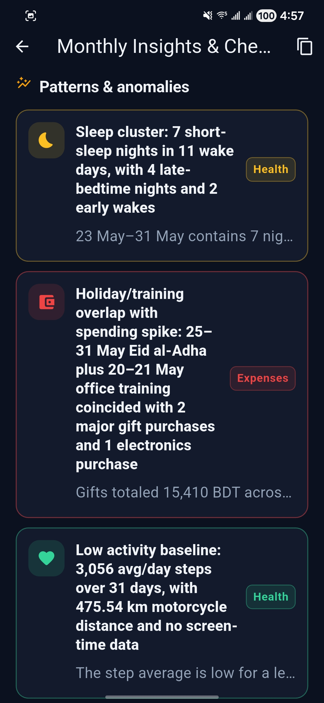<br><br>
      <sub><b>Results</b> — insight detail</sub>
    </td>
  </tr>
</table>

---

### ⑤ Checklists — plan the month ahead

Action items from a monthly-insights run become weekly checklists for the following month. Switch weeks from the horizontal picker.

<table cellpadding="28" cellspacing="20" border="0">
  <tr>
    <td align="center" colspan="2" valign="top" style="padding: 20px 24px;">
      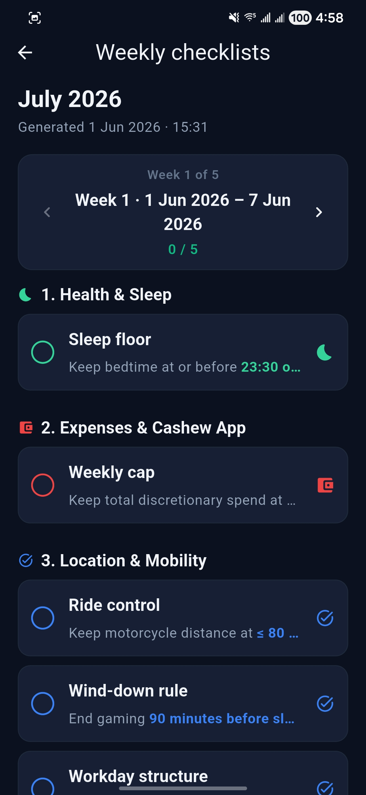<br><br>
      <sub><b>Checklist</b> — weekly segments & themes</sub>
    </td>
  </tr>
</table>

---

### ⑥ Progress review — score checklist targets

The **Review** tab shows how current-month data compares to checklist targets, with an overall score and per-domain breakdown.

<table cellpadding="28" cellspacing="20" border="0">
  <tr>
    <td align="center" colspan="2" valign="top" style="padding: 20px 24px;">
      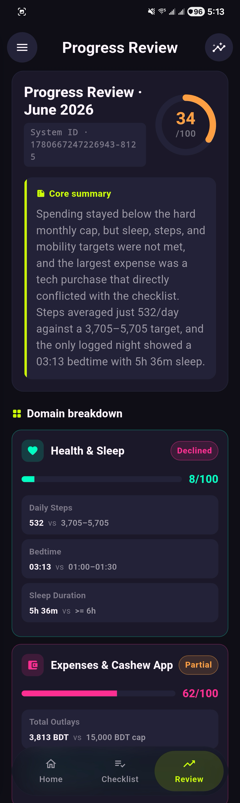<br><br>
      <sub><b>Review</b> — targets vs actuals</sub>
    </td>
  </tr>
</table>

---

### Settings — tune prompts & AI

Configure assistant identity, analysis month, reminders, and API settings from the drawer (**System Prompt**, **General**).

<table cellpadding="28" cellspacing="20" border="0">
  <tr>
    <td align="center" width="50%" valign="top" style="padding: 16px 24px;">
      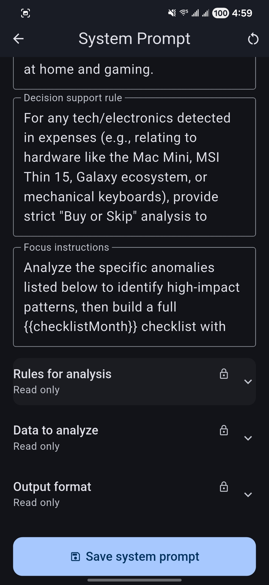<br><br>
      <sub><b>System Prompt</b> — AI & analysis tone</sub>
    </td>
    <td align="center" width="50%" valign="top" style="padding: 16px 24px;">
      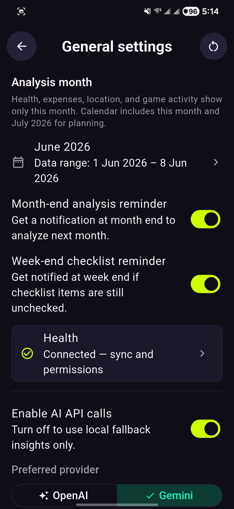<br><br>
      <sub><b>General</b> — month, reminders & AI provider</sub>
    </td>
  </tr>
</table>

## Features

| Module | Data source | Role in analysis |
|--------|-------------|------------------|
| **Health** | Health Connect: sleep (with stages) plus opt-in vitals (steps, heart rate, workouts, weight) | Monthly averages, patterns, sleep anomaly filtering |
| **Expenses** | Cashew CSV (data folder or Google Drive `Cashew/outbox.csv`) | Totals, categories, real vs. excluded transactions, money flow (savings, debts, typical month, income sources, repeat places), selectable spending categories |
| **Location** | User-selected timeline export files | Activity patterns, work-arrival stats |
| **Game activity** | CSV export (e.g. gaming tracker) | Session summaries |
| **Calendar** | Google Calendar (OAuth) | Events merged into the snapshot; future-event coverage check |
| **Dashboard** | All of the above | Reorderable analysis cards, stable-month detection, charts, and a **Predictions** section |
| **Results** | Generated locally or via API | Saved monthly-insight runs, rich-text reports, actionable checklists |
| **Progress review** | Checklist targets + current-month data | Domain scores comparing targets to actuals, with verified numeric deltas |
| **Export** | Same data the analysis uses | Raw markdown export, optionally AI-curated, for sharing with another assistant (no AI call unless you choose curation) |

**Main shell tabs:** **Home** (data hub), **Checklist** (weekly segments), **Review** (progress scores; opens the Results list from the app bar).

Drawer screens: **System Prompt** (assistant instructions and personal profile), **General** (analysis month, Health Connect, AI provider, notifications, backup), and per-feature **settings** (folders, permissions, Google sign-in).

### Predictions (dashboard)

Forecasts are computed on-device from your data; the AI layers are optional and need an AI provider:

- **Fuel** (`fuel_forecast.dart`, `fuel_forecast_ai.dart`): next refuel date and amount from past refuels and, when the location export overlaps enough of them, riding distance vs. typical tank range. The AI estimate weighs upcoming events and recent riding.
- **Recurring charges** (`recurring_forecast.dart`): bills and subscriptions expected to be charged again soon, with cadence detection.
- **Outlook** (`outlook_forecast.dart`, `outlook_ai.dart`): month-end projection and the date the budget runs out at a normal day's spending, with an optional AI reading.

## Analysis pipeline

1. **Entry:** `analysis/analysis_launcher.dart` (gated on a data folder and a complete personal profile).
2. **Period:** `analysis/analysis_period.dart`—current calendar month through today; the checklist targets the following month, split into weeks.
3. **Snapshot:** `results/analysis_snapshot_builder.dart` renders each selected source through its `*_prompt_builder.dart`, plus derived metrics and goal tracking.
4. **Prompt:** `results/analysis_prompt_renderer.dart` fills the user-editable template from `prompts/`.
5. **Generation:** `results/ai_client.dart` calls OpenAI, Gemini, or Claude (streamed, with retries and cancellation). With API calls off, a local heuristic generator produces a structured fallback report.
6. **Repair & validation:** `report_format_repair.dart` asks the model once to fix a missing checklist or week sections; the calendar future-event coverage check follows.
7. **Parse & persist:** `insights_parser.dart` produces insights and checklist actions, saved via `analysis_reports_storage.dart`/`results_service.dart`; monthly insights become the active checklist.
8. **Progress review & weekly verification** reuse the same machinery against a previous checklist; `ProgressReviewEvaluationEngine` enforces verified numbers.

## Architecture

```
lib/
  app/                  # App widget and route table
  core/                 # Period ranges, data cache, backup, folder settings, logging, notifications, theme
  features/
    analysis/           # Analysis kinds, period math, launcher, report storage
    auth/               # Google account / Firebase auth
    calendar/           # Google Calendar sync
    dashboard/          # Dashboard cards, charts, predictions
    expenses/           # Cashew CSV, insights, forecasts (fuel, recurring, outlook)
    export/             # Raw / AI-curated markdown data export
    game_activity/      # Gaming session CSV
    health/             # Health Connect: sleep, vitals
    home/               # Home grid, analyze & confirm dialogs, progress sheet
    location/           # Timeline export parsing
    onboarding/         # First-run walkthrough
    progress_review/    # Checklist-vs-actual scoring dashboard
    prompts/            # System prompt & personal information
    results/            # AI client, parsing, checklists, saved runs
    settings/           # General settings & AI provider
  shared/               # Shared widgets and navigation helpers
  shell/                # Main shell, drawer, bottom nav
```

Each feature typically has a `*_service.dart` (load/parse), a summary/model type, and often a `*_prompt_builder.dart`. Adding a data source means registering it in `analysis_kind.dart` and adding branches in `buildDataSnapshot` / `renderPrompt`.

- **State:** [flutter_riverpod](https://pub.dev/packages/flutter_riverpod)
- **Health:** [health](https://pub.dev/packages/health) + Health Connect, [permission_handler](https://pub.dev/packages/permission_handler)
- **Files & parsing:** [file_picker](https://pub.dev/packages/file_picker), [dir_picker](https://pub.dev/packages/dir_picker), [uri_content](https://pub.dev/packages/uri_content), [csv](https://pub.dev/packages/csv)
- **Google:** [google_sign_in](https://pub.dev/packages/google_sign_in) + [googleapis](https://pub.dev/packages/googleapis) (Calendar, Drive)
- **Firebase:** Auth + Firestore, used only for sign-in and syncing the personal-info profile (`firestore.rules` scopes each user to `users/{uid}/personalInfo`)
- **Storage:** `shared_preferences`, JSON file cache, [flutter_secure_storage](https://pub.dev/packages/flutter_secure_storage) for API keys
- **Notifications:** [flutter_local_notifications](https://pub.dev/packages/flutter_local_notifications) (month-end analysis and week-end checklist reminders)

## Getting started

### Prerequisites

- Flutter SDK (Dart ^3.11.5)
- Android device or emulator
- Firebase config (not committed): copy `lib/firebase_options.dart.example` to `lib/firebase_options.dart`, or run `flutterfire configure --project=<project-id>` to generate `lib/firebase_options.dart` and `android/app/google-services.json`
- For health: **Health Connect** installed; grant sleep access (and steps, heart rate, workouts, weight if you enable vitals), e.g. via Samsung Health → Health Connect
- For expenses: **Cashew** export folder on device storage, or Google Drive access
- For calendar: Google account with Calendar API access
- Optional: API keys for OpenAI, Gemini, or Claude in AI settings

### Run

```bash
flutter pub get
flutter run
```

### Checks

```bash
flutter analyze
dart format .
```

There is no CI config and no automated tests; run `flutter analyze` before calling work done.

## Privacy & data

All personal data stays on the device unless you opt into a cloud AI provider (OpenAI, Gemini, or Claude) and enable **API calls**. Summaries are cached as JSON files in the app-support `data_cache/` directory; small settings use `shared_preferences`; API keys live in the Android Keystore via `flutter_secure_storage`. Android backup is disabled (`allowBackup="false"`) so cached data and keys never reach Google Drive; the app has its own backup file (`personal-backup.json`) that excludes device-specific folder URIs and caches. Only the personal-info profile syncs to Firestore.

## Screenshot checklist

| File | Screen |
|------|--------|
| `docs/screenshots/01-home.png` | Home / Data hub |
| `docs/screenshots/02-health.png` | Health summary |
| `docs/screenshots/03-expenses.png` | Expenses |
| `docs/screenshots/04-location.png` | Location |
| `docs/screenshots/05-game-activity.png` | Game activity |
| `docs/screenshots/06-calendar.png` | Calendar |
| `docs/screenshots/07-analysis-confirm.png` | Analysis source picker |
| `docs/screenshots/08-results.png` | Results list |
| `docs/screenshots/09-checklists.png` | Weekly checklists |
| `docs/screenshots/10-prompts.png` | System Prompt configuration |
| `docs/screenshots/11-drawer.png` | Navigation drawer |
| `docs/screenshots/12-results-details.png` | Results — insight detail |
| `docs/screenshots/13-analyze-options.png` | Analyze — run type picker |
| `docs/screenshots/14-progress-review.png` | Progress review dashboard |
| `docs/screenshots/15-general-settings.png` | General settings |

## License

Private project — not published to pub.dev (`publish_to: 'none'`).
